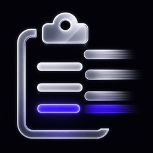

<p align="center">
  
</p>

<h1 align="center">MyClipboard</h1>

<p align="center">
  История буфера обмена · локально · без облака и аналитики
</p>

<p align="center">
  macOS Menu Bar · Windows трей · текст, изображения, файлы
</p>

---

## Установка

**Одна команда — самый быстрый и простой способ.** Скрипт сам скачает нужный ZIP и поставит приложение.

### macOS

```bash
curl -fsSL https://raw.githubusercontent.com/Lucem-afferens/MyClipboard-dist/main/install.sh | bash
```

Затем: **Menu Bar** (справа вверху) → **Системные настройки → Универсальный доступ** → включите MyClipboard → **⌘⌥V**.

### Windows

```powershell
irm https://raw.githubusercontent.com/Lucem-afferens/MyClipboard-dist/main/install.ps1 | iex
```

Затем: иконка в **трее** → **Ctrl+Alt+V**.

Пошагово со схемами: **[INSTALL.md](INSTALL.md)**

---

## Альтернатива: скачать ZIP

Если удобнее мышкой — [Releases](https://github.com/Lucem-afferens/MyClipboard-dist/releases) → **Assets** → **один** файл под вашу систему (оба качать не нужно):

| Система | Файл |
|---------|------|
| **Mac** | `MyClipboard-…-macOS.zip` |
| **Windows** | `MyClipboard-…-windows-x64.zip` |

Mac: распакуйте → `MyClipboard.app` в **Программы**. Windows: запустите `MyClipboard.exe`. Дальше — те же шаги с доступом / треем, что выше.

---

## Горячие клавиши

| | Панель истории | Быстрый цикл |
|--|----------------|--------------|
| **macOS** | **⌘⌥V** | **⌘⇧V** |
| **Windows** | **Ctrl+Alt+V** | **Ctrl+Shift+V** |

---

## Требования

| | |
|--|--|
| macOS | 14+ |
| Windows | 10 / 11, x64 |

Обновление: снова та же команда установки (или новый ZIP из Releases).

Что нового: [release-notes.md](release-notes.md)
